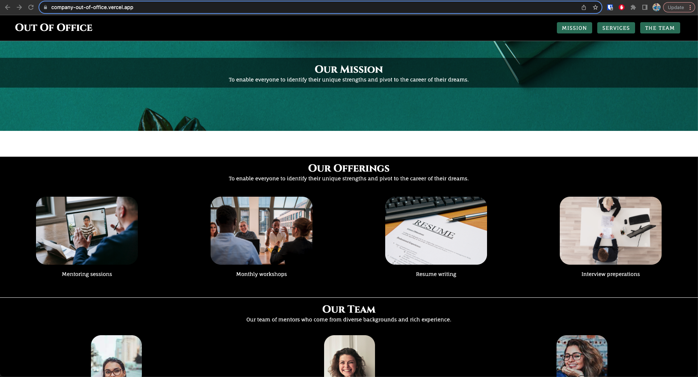

# Out Of Office Landing Page 

Welcome to the **Out Of Office** Landing Page project! In this project, we have created a responsive landing page for a fictional company called "Out Of Office." This landing page showcases the company's mission, services, and team members. The design is implemented using Flexbox and responsive design techniques with `@media` queries.

You can check it out on this link: [Out Of Office Landing Page](https://company-out-of-office.vercel.app/) 

## Project Overview

The Out Of Office Landing Page is designed to introduce users to the company's mission, services, and team in an elegant and visually appealing manner. The landing page includes the following sections:

- **Header:** A navigation bar with the company logo and tabs for easy navigation to different sections of the page.

- **Main Section:** Displays the company's mission, emphasizing the goal of helping individuals identify their unique strengths and transition to their dream careers.

- **Services Section:** Highlights the various services offered by the company, including mentoring sessions, monthly workshops, resume writing, and interview preparations.

- **Team Section:** Introduces the company's team members, showcasing their diverse backgrounds and expertise.

- **Footer:** Displays contact information and copyright details for the company.

## Features

The Out Of Office Landing Page boasts the following features:

- **Responsive Design:** The landing page is responsive and adapts to different screen sizes using Flexbox and responsive design principles.

- **Navigation:** The navigation bar allows users to quickly jump to different sections of the landing page.

- **Visual Elements:** Engaging images and icons are used to enhance the visual appeal and communicate the company's offerings effectively.

- **Typography:** Custom fonts (Cinzel and Fauna One from Google Fonts) are utilized to create a distinct and stylish typographic design.

## How to View

To view the Out Of Office Landing Page locally on your machine, follow these steps:

1. Clone or download this repository to your local machine.

2. Open the `index.html` file in your web browser.

3. Explore the different sections of the landing page, including the mission, services, and team information.

4. Resize your browser window to see the responsive design in action.

## Technologies Used

The Out Of Office Landing Page is developed using the following technologies:

- HTML: For structuring the content and layout of the landing page.
- CSS: For styling and designing the visual appearance of the landing page.
- Flexbox: For creating flexible and responsive layouts.
- `@media` Queries: For implementing responsive design by adjusting styles based on screen sizes.
- Google Fonts: For importing and applying custom fonts to the landing page.

## Acknowledgments

The Out Of Office Landing Page project is a demonstration of creating an engaging and responsive landing page for a fictional company. The project showcases the use of Flexbox and responsive design techniques to deliver a seamless user experience.

## Credits

Special thanks to Codecademy for providing valuable resources and tutorials for web development, contributing to the creation of the Out Of Office Landing Page.

---

Experience the elegance of "Out Of Office" through its stylish and responsive landing page. For any inquiries or feedback, feel free to contact us.

Explore the world of opportunities with Out Of Office! 🌟✨
